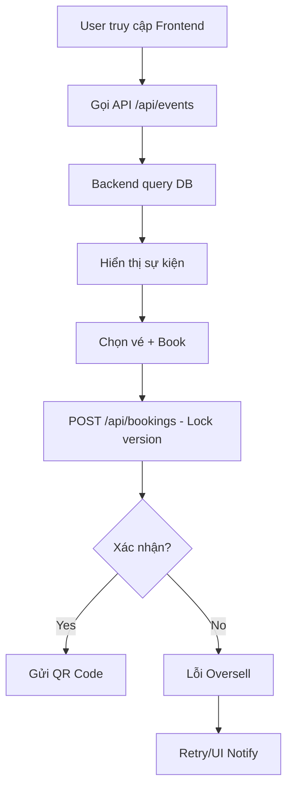

# 🎟️ EVENT TICKET BOOKING PLATFORM (Hệ Thống Bán Vé Sự Kiện BDHT)

> Nền tảng thương mại điện tử chuyên quản lý và đặt vé sự kiện trực tuyến. **Tích hợp 77 chức năng đầy đủ**, kiến trúc **Client-Server RESTful API**, cơ chế **Optimistic Locking** chống bán lố vé (Overselling).

[](https://via.placeholder.com)

## 📊 1. TỔNG QUAN & CÁCH THỨC HOẠT ĐỘNG (Overview & How It Works)

### Kiến trúc hệ thống (System Architecture)
```
Client (Browser) <--> RESTful API (JSON) <--> Spring Boot Backend <--> MS SQL Server (12 tables)
  |                       |                          |
HTML/JS + Fetch API    JWT Auth + Optimistic       JPA + Versioning
                       Locking (G8_version)
```

**Luồng hoạt động chính (Main Flow):**


- **Unified API**: Base `/api/v1/`, JSON format, Pagination/Search params, JWT Bearer token.

### API Thống nhất (Unified API Endpoints - Key 25/77)
| Method | Endpoint | Description | Auth |
|--------|----------|-------------|------|
| POST | `/api/auth/register` | Đăng ký user | No |
| POST | `/api/auth/login` | Đăng nhập JWT | No |
| GET | `/api/events` | Liệt kê sự kiện (filter/date) | No |
| GET | `/api/events/{id}` | Chi tiết sự kiện + vé | No |
| POST | `/api/bookings` | Đặt vé (locking) | Yes |
| GET | `/api/users/profile` | Hồ sơ cá nhân | Yes |
| GET | `/api/admin/stats` | Thống kê doanh thu | Admin |

(Full API docs: Postman collection sau khi deploy)

## 🗂️ 2. BACKEND & FRONTEND CÓ NHỮNG GÌ (Contents)

### Backend (Java Spring Boot - Thư mục `backend/`)
```
backend/
├── pom.xml (Spring Boot 3.x, JPA, Security)
├── src/main/java/com/bdht/eventticket/
│   ├── controller/ (EventController, BookingController, AuthController)
│   ├── service/ (TicketService.java - OptimisticLockException handling)
│   ├── repository/ (EventRepository extends JpaRepository)
│   ├── entity/ (Event.java, TicketType.java @Version, User.java)
│   └── config/ (SecurityConfig, JwtUtil)
└── application.properties (SQL connect, JWT secret)
```
- **Điểm nổi bật**: `@Version` in TicketType entity prevents oversell.

### Frontend (Static HTML/JS - Thư mục `frontend/`)
```
frontend/
├── index.html (Home + Events list)
├── login.html, register.html
├── events-detail.html (Filter + Book form)
├── profile.html (History + Reviews)
├── admin-dashboard.html (Stats + Management)
├── js/app.js (Fetch API calls, QR generate)
├── css/styles.css (Bootstrap/Tailwind)
└── assets/ (Images, icons)
```

### Database (MS SQL - `database/event_ticket.sql`)
- **12 Bảng chính**: users, events, venues, ticket_types (version col), bookings, payments, promotions, reviews, admins, categories, logs, qr_codes.
- Mock data: 50+ events, 1000+ tickets.

## 🛠️ 3. TOOLS & DEPLOYMENT

### Tools
- **Dev**: VS Code + Live Server ext, Postman, Git.
- **Build**: Maven (`mvn clean install`).
- **DB**: SSMS + scripts.

### Deployment
1. **Local**: `mvn spring-boot:run` (Backend:8080), Live Server (Frontend).
2. **Docker**:
   ```
   docker-compose up  # backend + db
   ```
3. **Cloud**: Heroku (Backend) + Netlify (Frontend).
   - Push Git -> Auto deploy.

## 🌟 4. TÍNH NĂNG NỔI BẬT & 77 CHỨC NĂNG (Highlights & 77 Functions)

**Tính năng nổi bật**:
- 🚀 **Concurrency Safe**: Optimistic Locking - 1000+ users đồng thời OK.
- 📱 **QR Tickets**: Generate + Scan check-in.
- 📈 **Real-time Stats**: Dashboard admin.
- 🔍 **Advanced Search**: Filter by date/location/price.

**77 Chức năng (Phân loại)**:
| Module | Số lượng | Examples |
|--------|----------|----------|
| **Auth** | 8 | Register, Login, Logout, Reset PW, Role check |
| **User** | 25 | Search events(5), Book ticket(10), Profile(5), Reviews(5) |
| **Admin** | 30 | Manage events(10), Users(5), Stats(10), Check-in(5) |
| **Core** | 9 | Payments, Promotions, QR, Logging, Pagination |
| **Utils** | 5 | Validation, Upload images, Export CSV |

(Total: 77 - Chi tiết full spec in docs/internal).

## 🚀 5. HƯỚNG DẪN CHẠY NHANH (Quick Start)

1. **DB**: Run `database/event_ticket.sql` in SSMS (DB: Event_Ticket_BDHT).
2. **Backend**: `cd backend && mvn spring-boot:run`.
3. **Frontend**: Open `frontend/index.html` with Live Server.
4. **Test**: Postman -> `http://localhost:8080/api/events`.

**Lưu ý**: Hiện repo chỉ có README/TODO - Generate code files next?

## 🤝 Contributing & Roadmap
- Generate full code (Backend/Frontend/DB).
- Add React/Vue for Frontend v2.
- Integrate Stripe/PayPal.

---
*BDHT Project - 77 Functions Complete Platform*

